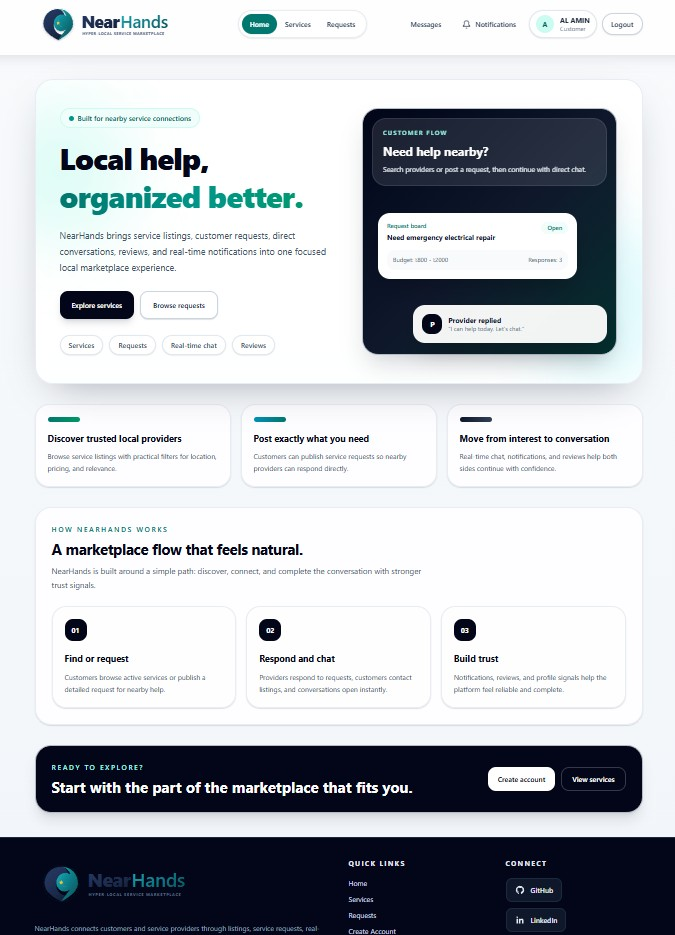
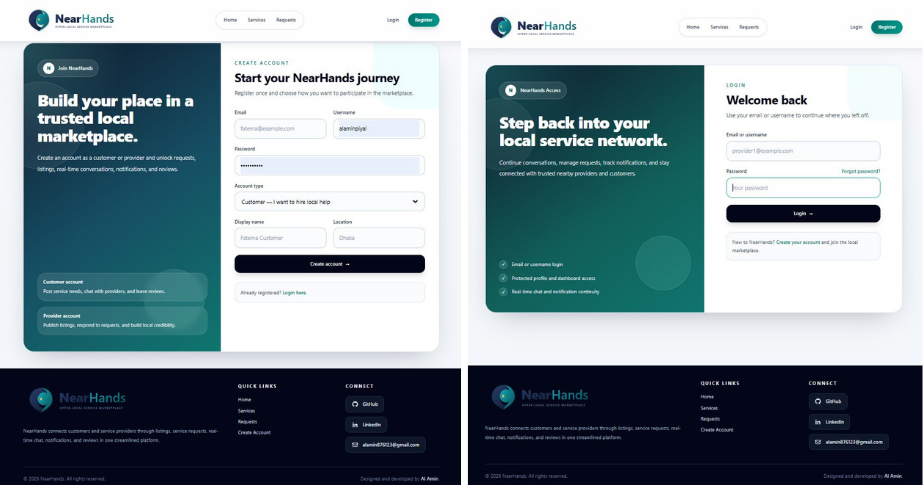
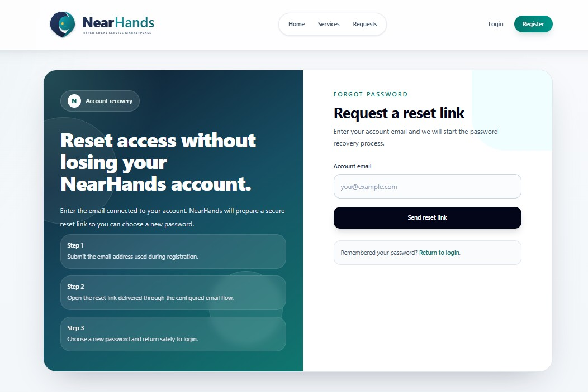
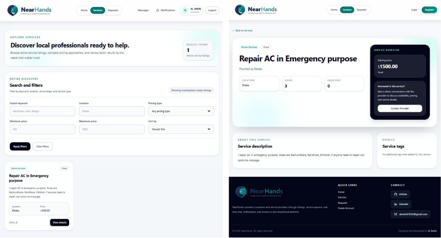
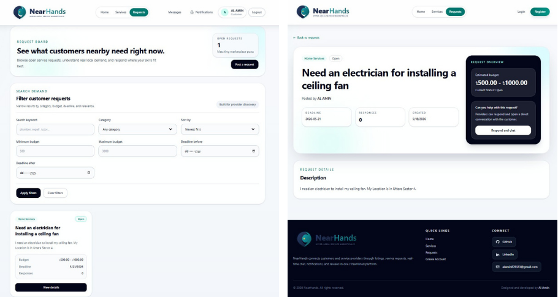
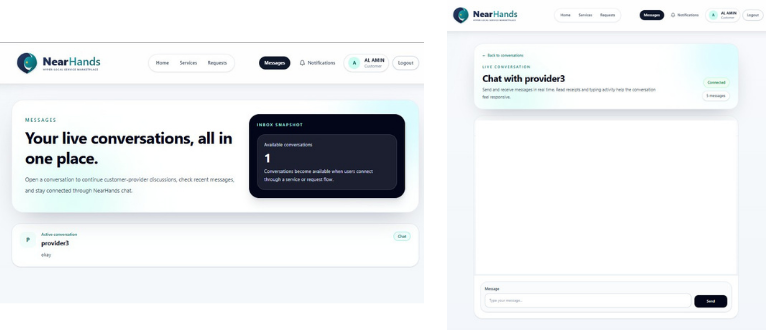
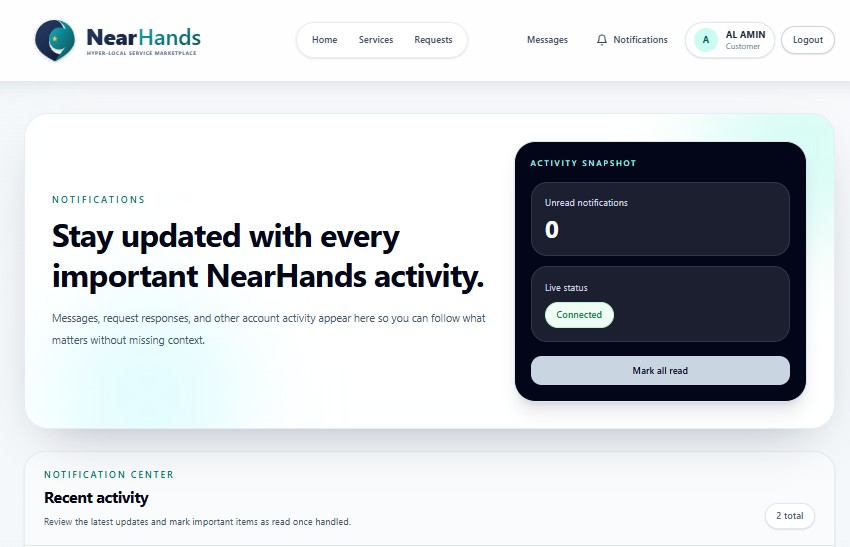
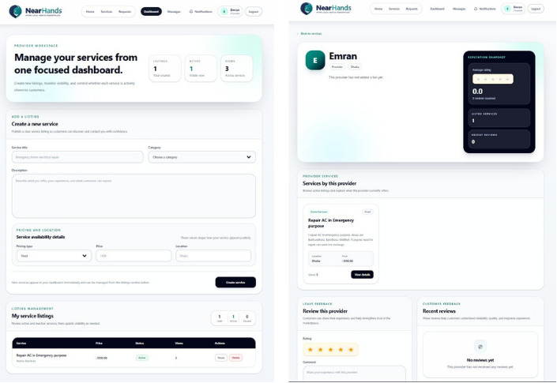
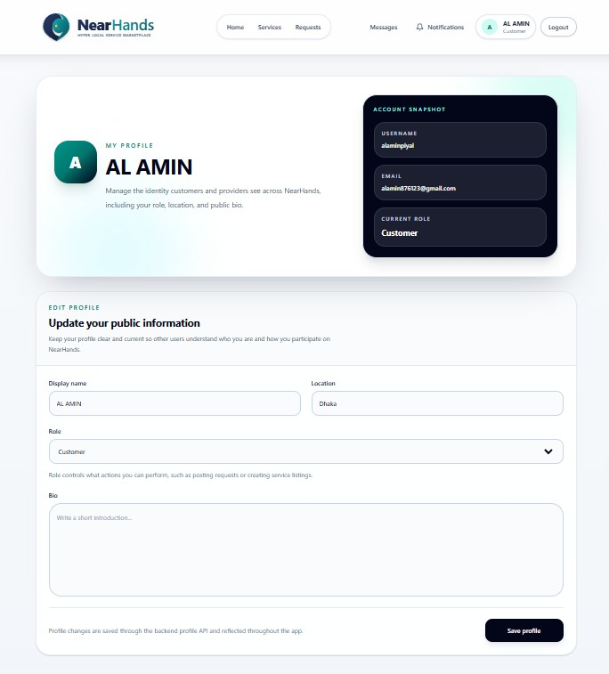
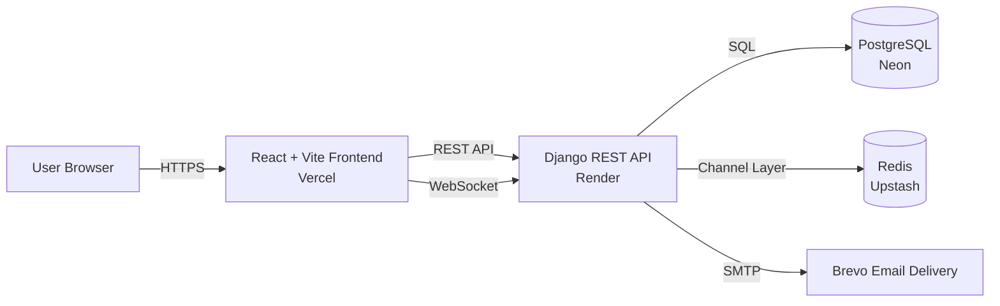

<p align="center">
  
</p>


> **A production-deployed hyper-local service marketplace that connects customers with nearby service providers through service discovery, request posting, real-time conversations, notifications, and trust-building reviews.**

NearHands is a full-stack marketplace platform designed to make local service coordination simpler, faster, and more transparent. Customers can browse available services, publish requests when they need help, communicate directly with providers, receive live notifications, and leave feedback after interacting. Providers can create and manage service listings, discover open customer requests, respond to opportunities, build a public reputation, and continue conversations in real time.

The project was built as a complete, deployable product rather than a static demonstration. It includes a modern responsive frontend, a REST API backend, role-aware customer/provider workflows, WebSocket-powered real-time features, production email delivery for password reset, containerized local development, CI automation, and a Postman collection for API testing.

---

## Live Project

| Resource | Link |
|---|---|
| **Live Website** | [near-hands.vercel.app](https://near-hands.vercel.app/) |
| **Backend API Documentation** | [Swagger / OpenAPI Docs](https://nearhands-backend.onrender.com/api/v1/docs/) |
| **Backend Base URL** | [nearhands-backend.onrender.com](https://nearhands-backend.onrender.com) |
| **Postman Exports** | [`postman/`](./postman) |

> Render's free backend instance may sleep after inactivity, so the first request can take a short moment to wake up.

---

## Project Preview



---

## Why NearHands?

Finding and coordinating local help is often fragmented. Customers may not know which nearby provider to contact, while providers may struggle to find relevant local demand. NearHands brings both sides into one focused marketplace experience.

### NearHands enables customers to:
- Discover active local service listings.
- Post detailed requests with category, budget, and deadlines.
- Review provider responses and start direct conversations.
- Receive live updates through notifications.
- Manage account details and recover access through password reset.

### NearHands enables providers to:
- Create and manage service listings from a dedicated dashboard.
- Browse customer requests and identify relevant opportunities.
- Respond to open requests and continue the discussion through chat.
- Build public credibility through profiles, service visibility, and reviews.
- Stay informed through real-time notifications.

---

## Core Marketplace Journey

```text
Discover services
        ↓
Post or browse requests
        ↓
Providers respond
        ↓
Customer and provider chat in real time
        ↓
Notifications keep both sides updated
        ↓
Reviews and profiles build trust
```

---

## Key Features

| Area | Highlights |
|---|---|
| **Authentication** | Registration, login, JWT-based auth, logout, protected routes, password reset. |
| **Roles** | Separate customer and provider experiences with role-aware flows. |
| **Services** | Service creation, listing management, discovery, search, filtering, and detail views. |
| **Requests** | Customers post requests; providers browse, inspect, and respond. |
| **Messaging** | Real-time customer-provider conversations over WebSockets. |
| **Notifications** | Live in-app activity notifications with unread state. |
| **Profiles** | Editable account profiles and public provider profile presentation. |
| **Reviews** | Provider reputation and feedback workflow. |
| **Email Delivery** | Production password reset emails through Brevo SMTP. |
| **API Tooling** | Swagger docs and Postman collection/environment exports. |
| **DevOps** | Docker Compose for local services, GitHub Actions CI, cloud deployment. |

---

# Product Walkthrough

## 1. Authentication and Account Recovery

NearHands offers a polished onboarding flow. Users can register as either a **customer** or a **provider**, return through a dedicated login experience, and recover account access through a production-ready password reset flow.

### Registration and Login



### Password Reset



---

## 2. Service Discovery

Customers can browse service listings, filter marketplace offerings, and open detailed service pages to understand pricing, location, and provider information before starting a conversation.



---

## 3. Customer Request Flow

When a customer needs something specific, they can post a request. Providers can inspect open requests, review the budget and timeline, and respond directly.



---

## 4. Real-Time Messaging

NearHands includes direct, live conversation support between customers and providers. The messaging experience is powered by Django Channels, Redis, and WebSockets so messages can update without requiring a page refresh.



---

## 5. Live Notifications

The notification center keeps users updated about important marketplace activity and displays connection-aware real-time status.



---

## 6. Provider Workspace and Trust System

Providers receive a dedicated dashboard to create and manage listings. Public provider profiles surface service visibility, reputation signals, and review functionality to help build trust within the marketplace.



---

## 7. Account Profile Management

Users can manage public account information such as display name, location, role, and bio from a focused profile area.



---

# Customer vs Provider Experience

| Customer Experience | Provider Experience |
|---|---|
| Browse available services | Publish service listings |
| Search and filter service options | Manage service visibility and details |
| Post service requests | Browse customer requests |
| Review provider responses | Respond to open requests |
| Start direct conversations | Continue conversations with customers |
| Receive real-time notifications | Receive real-time notifications |
| Leave reviews after interactions | Build credibility through reviews |

---

# Technology Stack

## Frontend
- React
- Vite
- Tailwind CSS
- React Router
- Axios

## Backend
- Django
- Django REST Framework
- Django Channels
- Simple JWT
- Daphne

## Data and Real-Time Infrastructure
- PostgreSQL
- Redis
- WebSockets

## Deployment and Operations
- Vercel — frontend hosting
- Render — backend hosting
- Neon — managed PostgreSQL
- Upstash — managed Redis
- Brevo SMTP — transactional password reset email delivery
- GitHub Actions — CI checks

## Local Tooling
- Docker Compose
- Postman

---

# System Architecture



---

# Repository Structure

```text
NearHands/
├── .github/
│   └── workflows/
│       └── ci.yml
├── backend/
│   ├── accounts/
│   ├── chat/
│   ├── core/
│   ├── notifications/
│   ├── reviews/
│   ├── service_requests/
│   ├── services/
│   ├── Dockerfile
│   ├── manage.py
│   ├── requirements.txt
│   └── .env.example
├── frontend/
│   ├── public/
│   ├── src/
│   ├── package.json
│   ├── vercel.json
│   └── .env.example
├── docs/
│   └── screenshots/
├── postman/
│   ├── NearHands_API.postman_collection.json
│   ├── NearHands Local.postman_environment.json
│   ├── NearHands Docker Local.postman_environment.json
│   └── NearHands Production.postman_environment.json
├── docker-compose.yml
├── README.md
└── .gitignore
```

---

# Local Development Setup

## 1. Clone the Repository

```bash
git clone https://github.com/alaminpiyal2002/NearHands.git
cd NearHands
```

---

## 2. Configure Environment Files

Create local environment files from the examples:

```bash
cp backend/.env.example backend/.env
cp frontend/.env.example frontend/.env
```

On Windows PowerShell:

```powershell
Copy-Item backend/.env.example backend/.env
Copy-Item frontend/.env.example frontend/.env
```

Update values as needed for your local environment.

---

## 3. Start Backend Services with Docker

From the project root:

```bash
docker compose up --build
```

This starts the backend application and its supporting services for local development.

---

## 4. Start the Frontend

Open a second terminal:

```bash
cd frontend
npm install
npm run dev
```

The frontend will typically run at:

```text
http://localhost:5173
```

The backend will typically run at:

```text
http://localhost:8000
```

---

# Environment Variables

## Backend Environment

The backend uses variables similar to:

| Variable | Purpose |
|---|---|
| `SECRET_KEY` | Django secret key |
| `DEBUG` | Development/production toggle |
| `ALLOWED_HOSTS` | Permitted backend hosts |
| `DATABASE_URL` | PostgreSQL connection URL |
| `REDIS_URL` | Redis connection URL for Channels |
| `CORS_ALLOWED_ORIGINS` | Allowed frontend origins |
| `FRONTEND_URL` | Frontend URL used in password reset links |
| `DEFAULT_FROM_EMAIL` | Visible sender for outgoing emails |
| `EMAIL_BACKEND` | Django email backend |
| `EMAIL_HOST` | SMTP host |
| `EMAIL_PORT` | SMTP port |
| `EMAIL_USE_TLS` | SMTP TLS toggle |
| `EMAIL_HOST_USER` | SMTP login |
| `EMAIL_HOST_PASSWORD` | SMTP key/password |

> In production, email delivery is configured through Brevo SMTP so password reset emails are sent to real inboxes.

---

## Frontend Environment

| Variable | Purpose |
|---|---|
| `VITE_API_BASE_URL` | REST API base URL |
| `VITE_WS_BASE_URL` | WebSocket backend base URL |

---

# Testing and Verification

## Backend Checks

```bash
docker compose exec web python manage.py check
docker compose exec web python manage.py test
```

## Frontend Checks

```bash
cd frontend
npm run lint
npm run build
```

The project was verified locally and deployed with working:
- Authentication
- API routes
- Request/service flows
- Real-time chat
- Real-time notifications
- Password reset email delivery

---

# API Documentation and Postman

## Swagger API Docs

Interactive backend API docs are available here:

[https://nearhands-backend.onrender.com/api/v1/docs/](https://nearhands-backend.onrender.com/api/v1/docs/)

---

## Postman Collection

The repository includes a GitHub-ready Postman export in:

```text
postman/
```

Included files:

```text
NearHands_API.postman_collection.json
NearHands Local.postman_environment.json
NearHands Docker Local.postman_environment.json
NearHands Production.postman_environment.json
```

### Recommended Postman workflow

1. Import the collection JSON file.
2. Import the environment file you need.
3. Select the environment in Postman.
4. Run authentication requests to obtain tokens.
5. Store access/refresh tokens in the selected environment.
6. Test the rest of the endpoints.

---

# Deployment Overview

| Component | Platform |
|---|---|
| Frontend | Vercel |
| Backend | Render |
| PostgreSQL Database | Neon |
| Redis / WebSocket Channel Layer | Upstash |
| Transactional Email | Brevo SMTP |
| CI | GitHub Actions |

## Production URLs

| Service | URL |
|---|---|
| Frontend | [https://near-hands.vercel.app/](https://near-hands.vercel.app/) |
| Backend | [https://nearhands-backend.onrender.com](https://nearhands-backend.onrender.com) |
| API Docs | [https://nearhands-backend.onrender.com/api/v1/docs/](https://nearhands-backend.onrender.com/api/v1/docs/) |

---

# Deployment Notes

- Render runs backend migrations at startup.
- Seed data for service categories/tags is applied during backend startup.
- The frontend includes a `vercel.json` rewrite configuration so React Router pages continue to work when refreshed directly.
- Password reset links point to the deployed frontend.
- Brevo SMTP uses an alternate port compatible with the current deployment environment.

---

# Future Enhancements

Possible improvements for future versions:

- Custom domain and branded email domain authentication
- Richer search and recommendation logic
- Service image uploads
- Booking and scheduling workflows
- Payment integration
- Admin analytics and moderation tools
- Expanded notification preferences
- Mobile-first app companion

---

# Author

**Al Amin**

- GitHub: [alaminpiyal2002](https://github.com/alaminpiyal2002)
- LinkedIn: [linkedin.com/in/alaminpiyal](https://www.linkedin.com/in/alaminpiyal)
- Email: [nearhands.supports@gmail.com](mailto:nearhands.supports@gmail.com)

---

## Closing Note

NearHands demonstrates a complete full-stack marketplace workflow: polished frontend UX, a structured REST API, role-based product flows, real-time communication, live notifications, production password recovery, containerized development, and cloud deployment. It is designed to be understandable to everyday visitors while still showcasing the engineering decisions needed to build and ship a modern web application.
